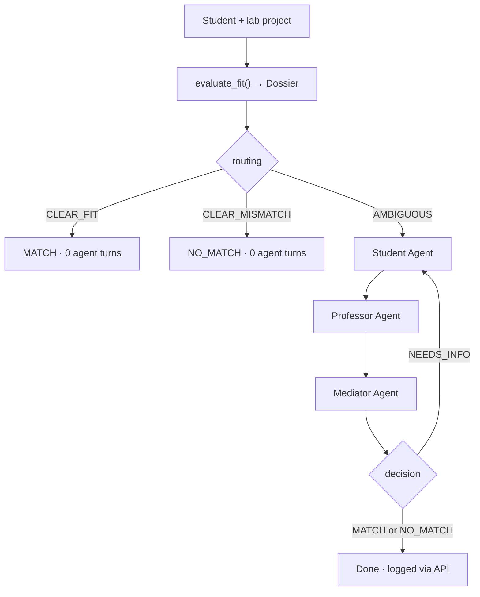

# OfficeHours

**Evidence-first opportunity coordination — multi-agent negotiation only when fit is ambiguous.**

[]()
[]()

---

## Judge snapshot (< 60 seconds)

| Question | Answer |
|----------|--------|
| **What problem?** | Strong students and real lab opportunities miss each other — project evidence stays buried, filters reject too early, and there is no structured hearing for ambiguous fit. |
| **What do you ship?** | A **deterministic dossier** for each student–project pair, then **three LLM agents only when routing is `AMBIGUOUS`**. |
| **Why not a ChatGPT wrapper?** | `evaluate_fit()` is **rules-only and inspectable** — agents resolve objections over evidence, not a black-box similarity score. |
| **Production-shaped?** | FastAPI · PostgreSQL · logged negotiations · swappable LLM (Anthropic / GMI). |

**Live demo:** `python3 demo.py` → **Aisha Patel** (weak on paper, strong build signals) × **MIT soft robotics** → dossier **`AMBIGUOUS`** → agents → **`MATCH`** (recommend a conversation, not automatic placement).

---

## The problem

Campus opportunities fail at **coordination**, not because people or projects do not exist.

- Capstones, builds, and side projects **disappear** after grades are posted.
- Students are filtered out by **keywords and credentials** before a PI sees real evidence.
- Labs need a **pair-level** answer: does *this* person fit *this* opportunity *now*?

OfficeHours answers that question in two layers: a **dossier** (transparent rules) and an **agent hearing** (only when the dossier says uncertainty remains).

---

## How it works

### 1. Dossier first (`evaluate_fit`)

Before any agent runs, `evaluate_fit(student, project)` returns a **`Dossier`**.

| Property | Detail |
|----------|--------|
| **Deterministic** | No LLM inside `evaluate_fit` — judges can audit the logic. |
| **Evidence sources** | `skills`, `intake_summary`, `extra_signals` vs project `required_skills` and `preferred_background`. |
| **Output** | Routing, skill coverage, strengths, risks, open questions (max 2), and a human-readable summary. |

### 2. Routing



| Routing | When | Agents run? | Result |
|---------|------|-------------|--------|
| **`CLEAR_FIT`** | Required skills evidenced; no material open questions | **No** | Immediate `MATCH` |
| **`CLEAR_MISMATCH`** | Required skill missing; no ownership signals to compensate | **No** | Immediate `NO_MATCH` |
| **`AMBIGUOUS`** | Gaps plus strong project evidence, inferred skills, or soft background mismatch | **Yes** | `MATCH` / `NO_MATCH` / `NEEDS_INFO` (up to **6** turns, then forced terminal decision) |

> **Demo tip:** Default `demo.py` pair routes **`AMBIGUOUS`** and runs all three agents. Seeded student **Marcus** may hit **`CLEAR_MISMATCH`** (agents skipped) — use Aisha for the full agent story.

### 3. Agents (only if `AMBIGUOUS`)

Each agent receives a **different dossier slice** — advocate, gate, and arbiter are not the same prompt.

| Agent | Role | Dossier slice | Responsibility |
|-------|------|---------------|----------------|
| **Student** | Advocate | `strengths` | Surface buried evidence; respond to objections honestly. |
| **Professor** | Gate | `risks`, `uncertainties` | Enforce requirements; ask one focused question when unclear. |
| **Mediator** | Arbiter | `uncertainties`, `summary` | Issue `DECISION: MATCH \| NO_MATCH \| NEEDS_INFO` with a short, evidence-based justification. |

---

## Architecture

```
┌─────────────────────────────────────────────────────────────┐
│  FastAPI  ·  PostgreSQL (student.*, lab.*)  ·  negotiation_logs │
└────────────────────────────┬────────────────────────────────┘
                             │
                    run_negotiation()
                             │
              ┌──────────────┴──────────────┐
              ▼                             ▼
     evaluate_fit()                  LLM agents (if AMBIGUOUS)
     rules-only Dossier              Anthropic / GMI via llm_client.py
```

| Layer | Stack |
|-------|--------|
| API | FastAPI + Uvicorn |
| Data | PostgreSQL, SQLAlchemy async |
| Matching | `app/agents/fit.py` → `Dossier` |
| Agents | Plain Python + direct LLM calls (no agent framework) |
| Observability | Phinite hooks in `agent_runtime.py` (SDK-ready stubs) |

---

## `Dossier` schema

```python
# app/agents/fit.py
def evaluate_fit(
    student_profile: StudentProfile,
    project: LabProject,
    conversation_history: list[dict],
) -> Dossier:
    ...
```

| Field | Purpose |
|-------|---------|
| `routing` | `CLEAR_FIT` \| `CLEAR_MISMATCH` \| `AMBIGUOUS` |
| `routing_reason` | One-line explanation of the route |
| `skills_met` | e.g. `"3/4"` |
| `skill_gaps` | Required skills not explicitly evidenced |
| `strengths` | Student agent — what to advocate |
| `risks` | Professor agent — requirement gaps |
| `uncertainties` | Mediator — open questions (**max 2**; alias `open_questions`) |
| `dimensions` | Structured assessments (skills, ownership, preferred background) |
| `overall_confidence` | Summary score (`score` alias) |
| `summary` | Human-readable overview |

---

## Quick start

### Terminal demo (no database — best for judges)

```bash
git clone https://github.com/jayashreejohnson/OfficeHours.git
cd OfficeHours
python3 -m venv .venv && source .venv/bin/activate
pip install "python-dotenv>=1.0" "pydantic>=2.7" "pydantic-settings>=2.2" "anthropic>=0.28"
cp .env.example .env   # set ANTHROPIC_API_KEY=
python3 demo.py
```

Expect a printed **DOSSIER** block, then agent turns if routing is `AMBIGUOUS`.

### Full API + database

```bash
python3 -m venv .venv && source .venv/bin/activate
pip install -e .
# If editable install fails:
# pip install fastapi uvicorn pydantic pydantic-settings sqlalchemy asyncpg \
#   python-dotenv anthropic beautifulsoup4 requests

cp .env.example .env
python app/seed.py    # Postgres required — MIT labs + demo students
python run.py         # http://localhost:8000/docs
```

---

## API

| Method | Path | Description |
|--------|------|-------------|
| GET | `/health` | Health check |
| GET | `/students` | List students |
| GET | `/students/{student_id}` | Get one student |
| POST | `/students` | Create student profile |
| GET | `/projects` | List lab projects |
| GET | `/projects/{project_id}` | Get one project |
| POST | `/negotiate?student_id=&project_id=` | Dossier pre-screen + negotiation; saves log |
| GET | `/negotiations` | List past runs (summary) |

---

## Why not embeddings or resume ranking?

- **Pair-level** fit for **this** opportunity, not a global profile score.
- **Inspectable rules** run before any LLM token is spent.
- **Agents activate only on `AMBIGUOUS`** — clear cases short-circuit instantly.
- Negotiations are **logged** for auditability (API path).

---

## Project structure

```
app/
├── models.py            # StudentProfile, LabProject, Dossier, AgentMessage
├── agents/
│   ├── fit.py           # evaluate_fit() — deterministic dossier + routing
│   ├── student_agent.py
│   ├── professor_agent.py
│   └── mediator_agent.py
├── negotiation.py       # Pre-screen → short-circuit or agent loop
├── llm_client.py
├── agent_runtime.py
├── main.py
├── db_models.py
├── seed.py
└── scraper.py
demo.py · run.py
```

---

## Sponsor integrations

| Sponsor | How |
|---------|-----|
| **GMI** | Set `GMI_API_KEY` and `GMI_ENDPOINT` in `.env` — `llm_client.py` switches provider with no agent changes. |
| **Phinite** | Implement stubs in `agent_runtime.py` (`register_identity`, `trace_event`, `log_decision`) with the Phinite SDK at kickoff. |

---

## Team

Built for **NY Tech Week — AI Agents: From Prototype to Production** (2026-06-03).

| Name | GitHub | Role |
|------|--------|------|
| Jayashree Johnson | [@jayashreejohnson](https://github.com/jayashreejohnson) | Product logic, dossier design, matching rules |
| Shageenth Sandrakumar | [@shageenthsandrakumar](https://github.com/shageenthsandrakumar) | Backend, negotiation loop, API, integrations |

**Contributions welcome:** frontend (live dossier + agent transcript), Phinite SDK wiring, Railway deploy — open an issue or PR on `main`.

---

## Roadmap

- Return dossier on `/negotiate` JSON response  
- Proactive surfacing (discovery before search)  
- Rich intake flow and optional PI constraints (opt-in; not GPA-first by default)  

---

## License

See [LICENSE](LICENSE).
